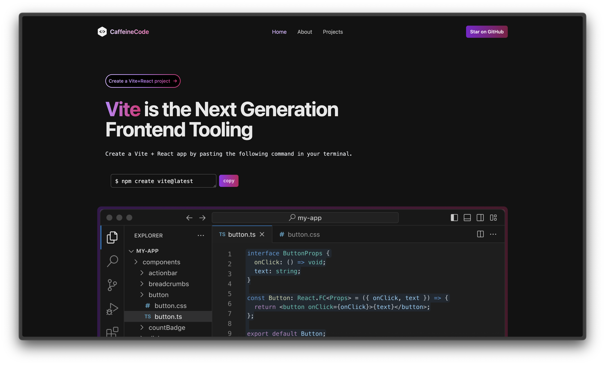

<div align="center">

[](https://skillicons.dev) 

</div>



## Vite + React
```bash
$ git clone https://github.com/mounishvatti/caffeinecode.git
```
```bash
$ cd caffeinecode
npm install
npm run dev
```

## Install TailwindCSS
```bash
npm install -D tailwindcss postcss autoprefixer
npx tailwindcss init -p
```

`Documentation` - https://tailwindcss.com/docs/guides/vite